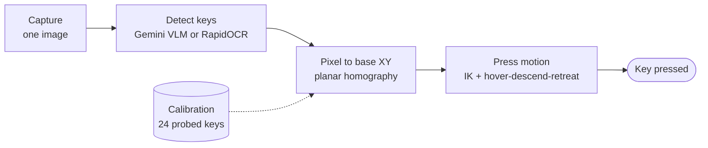
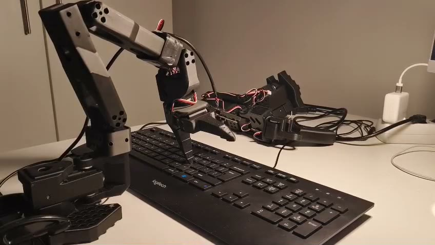
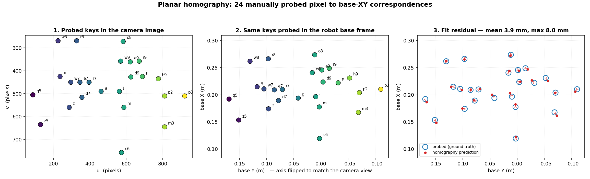
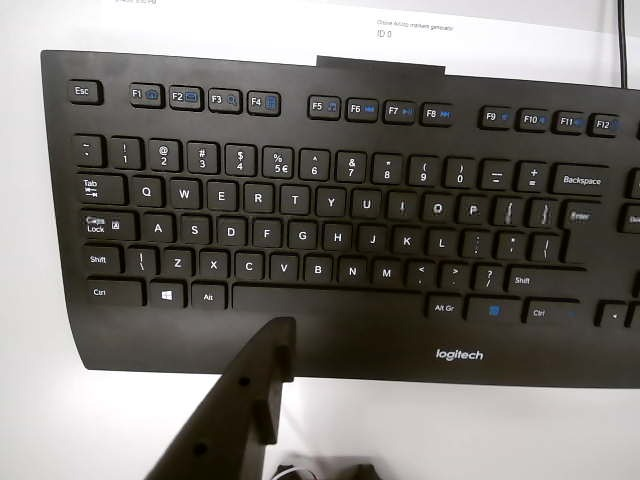
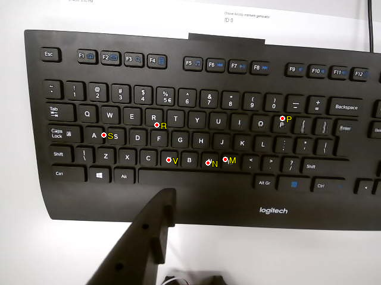

# Robot Learning Project — Keyboard Typing (Group 4)

ETH Zürich, Robot Learning Spring 2026. An SO-101 robot arm types on a
physical US-layout keyboard using vision-based key detection and
homography-based coordinate mapping.

## Framework

The system uses no trainable policy and no checkpoints. It is a
calibrate-once, then detect-and-act pipeline. One planar homography carries
the whole geometric burden: it converts a key seen in the camera image into
a 3D point in the robot base frame.



### Hardware setup



An SO-101 follower arm stands beside a US-layout keyboard that lies flat on
the desk. The webcam is mounted on the arm, so the view depends on the arm
pose. A rigid fingertip on the gripper presses the keys.

### Step 0 — Calibration (done once)

The operator drives the fingertip onto about two dozen physical keys. For
each key the system records two things: the pixel where the key appears in
the camera image, and the fingertip position in the robot base frame. This
produces the pixel-to-world correspondences that the pipeline needs.

Because the keyboard is flat, one planar homography `H` fits all of these
pairs. The figure below shows the 24 correspondences that ship in
[`new_approach_with_homography/calibration.json`](new_approach_with_homography/calibration.json).
Panels 1 and 2 are the same keys seen in the two coordinate frames. Panel 3
shows the fit residual.



The fit is accurate to **3.9 mm on average, 8.0 mm at worst**. A keycap is
about 19 mm wide, so this error stays well inside one key.

Calibration must be repeated if the camera moves or the keyboard is
displaced. See [Calibration](#calibration) for the commands.

### Step 1 — Capture



The arm moves to a fixed viewing pose and takes a single frame. The whole
keyboard must be visible. The pipeline takes one image per run, not a video
stream.

### Step 2 — Key detection

The image goes to a key locator, which returns the image position of every
requested letter. Two locators are interchangeable:

| Locator | Notes |
|---------|-------|
| Gemini VLM | Needs `GEMINI_API_KEY` and a network call. More robust to glare and to unknown keyboard layouts. |
| RapidOCR | Runs locally, no API key, faster. Weaker on low-contrast keycaps. |

Both return normalized coordinates on a 0–1000 grid. The pipeline scales
them back to real pixels using the `image_resolution` field of the task
config. Each run writes an overlay image so the detection can be checked by
eye. Detected key centers are red dots with a letter label:

| Anchor keys (Q, A, Z, M, L, P) | Target letters of a sentence |
|---|---|
|  |  |

### Step 3 — Pixel to 3D

The homography `H` maps each detected pixel `(u, v)` to a point `(X, Y)` in
the robot base frame. The third coordinate is not estimated. It is fixed to
the `plane_z` constant of the task config, because every keycap lies on the
same plane. Typical value: 0.0165–0.017 m.

### Step 4 — Press motion

For every target key the arm executes the same three-part primitive:

1. **Hover** — move to a pose 0.06 m above the key, biased to the side so
   the arm does not sweep across other keys.
2. **Descend** — lower straight onto the keycap.
3. **Retreat** — lift back to the hover height and continue to the next key.

Inverse kinematics solves each pose with the fingertip forced to point
straight down. Segments are quintic splines of 115–150 waypoints, so the
motion stays smooth and the arm does not overshoot.

A single press primitive, seen from the side. The arm hovers, descends onto
the key, then retreats:

https://github.com/user-attachments/assets/21a8ff59-6360-4383-b4b1-79db71869693

The same motion from above. This view shows the fingertip contact and the
sideways bias that keeps the arm clear of the neighbouring keys:

https://github.com/user-attachments/assets/50f3d251-c173-46e4-9b9e-73ecfcdab8d4

### What changes between the eval tasks

All three tasks run the same four steps. Only the config differs:

| | Eval 1 (SPACE, ENTER, R, L) | Eval 2 (single letter) | Eval 3 (sentence) |
|---|---|---|---|
| `plane_z` | 0.017 m | 0.0165 m | 0.0165 m |
| Waypoints per segment | 140 | 150 | 115 |
| Contact auto-stop | off | off | **on** |

Auto-stop is the one behavioral difference. In Eval 3 the descent is cut
short as soon as the end-effector orientation stops changing, which means
the fingertip has met the keycap. If no contact is detected, the press is
retried at a lower descent height. This matters because a sentence needs
many presses in a row, so a single missed key would corrupt the output.

## Demo

Full runs of the three eval tasks on the real robot.

### Eval 1 — Press SPACE, ENTER, R, L

https://github.com/user-attachments/assets/7aea9fed-bcfc-493d-acc7-3c914aa106e6

### Eval 2 — Type a single letter

https://github.com/user-attachments/assets/21a8ff59-6360-4383-b4b1-79db71869693

### Eval 3 — Type a sentence

https://github.com/user-attachments/assets/6c866784-714c-4f5a-aa79-8b279d136c8c

### Eval 3 on an unknown keyboard

The same pipeline runs on a keyboard that was not used for calibration. Only
the key detection of Step 2 sees the new layout. The homography of Step 0 is
unchanged.

https://github.com/user-attachments/assets/e0e522c6-2f4e-4165-b81a-a006bc052514

### Demo day

https://github.com/user-attachments/assets/50f3d251-c173-46e4-9b9e-73ecfcdab8d4

https://github.com/user-attachments/assets/cfce98c5-15f7-4a5c-9b88-726496722e7b

## Prerequisites

| Requirement | Details |
|-------------|---------|
| OS | Linux (tested on Ubuntu under WSL2) |
| Python | 3.12 |
| Hardware | SO-101 follower arm (Feetech STS3215), USB webcam |
| API key | Google Gemini (`GEMINI_API_KEY` in `.env`) |

## Installation

```bash
# 1. Create conda environment
conda create -y -n lerobot python=3.12
conda activate lerobot

# 2. System dependencies
conda install -y -c conda-forge evdev ffmpeg

# 3. Python dependencies
pip install -r requirements.txt

# 4. Environment variables
cp example.env .env
# Edit .env and fill in:
#   GEMINI_API_KEY  — Google Gemini API key
#   PORT            — serial port for the robot (e.g. /dev/ttyACM0)
#   CAMERA_INDEX    — OpenCV camera index (integer)
#   PROJECT_PATH    — absolute path to this repository root
```

## Calibration

Before running the eval tasks, two calibration steps are required:

### 1. Robot joint calibration

The LeRobot calibration file for the follower arm is shipped in
`new_calibration/calibration_follower.json`. This was generated by running
the standard LeRobot calibration routine on the physical robot. To install
it into the lerobot cache:

```bash
bash scripts/install_calibrations.sh
```

### 2. Pixel-to-world homography calibration

The file `new_approach_with_homography/calibration.json` contains ~24
correspondence points mapping image pixels to 3D world positions. These
were collected by physically moving the robot fingertip to known keyboard
locations using:

```bash
cd new_approach_with_homography
python manual_pose_probe.py
```

The shipped `calibration.json` is ready to use with our hardware setup. If
the camera or keyboard position changes, re-run the probe script.

### Optional: camera intrinsics calibration

```bash
python camera/calibrate_camera.py
```

## Running the Eval Tasks

Each eval task has a dedicated `run_eval_X.sh` script. These scripts assume
the conda environment is activated and `.env` is configured.

### Eval 1 — Press SPACE, ENTER, R, L

```bash
./run_eval_1.sh
```

### Eval 2 — Type a single letter

```bash
./run_eval_2.sh <letter>
# Example:
./run_eval_2.sh H
```

To run all 26 letters with timing:

```bash
./task2_all_letters.sh
```

### Eval 3 — Type a sentence

```bash
./run_eval_3.sh "<sentence>"
# Example:
./run_eval_3.sh "hello world"
```

## Repository Structure

```
.
├── run_eval_1.sh                  # Eval 1 launcher
├── run_eval_2.sh                  # Eval 2 launcher
├── run_eval_3.sh                  # Eval 3 launcher
├── task2_all_letters.sh           # Run eval 2 for all 26 letters
├── requirements.txt               # Python dependencies
├── example.env                    # Template for .env configuration
│
├── new_approach_with_homography/  # Core pipeline
│   ├── pipeline.py                #   Main pipeline (eval 2, 3)
│   ├── pipeline_first_task_single_vlm.py  #   Eval 1 pipeline
│   ├── pipeline_config_task1.json #   Config for eval 1
│   ├── pipeline_config_task2.json #   Config for eval 2
│   ├── pipeline_config_task3.json #   Config for eval 3
│   ├── take_picture.py            #   Camera capture from robot pose
│   ├── vlm_keyboard_coords.py    #   Gemini VLM key detection
│   ├── ocr_keyboard_coords.py    #   Local OCR key detection
│   ├── compute_3d_pos.py          #   Pixel-to-3D via homography
│   ├── go2target.py               #   IK-based robot motion
│   ├── calibration.json           #   Pixel-to-world correspondences
│   └── manual_pose_probe.py       #   Tool to collect calibration points
│
├── 3d_coordinates/
│   └── overlay_script.py          # Debug overlay (used by pipeline)
│
├── calibration/                   # Old calibration data
├── new_calibration/               # Robot URDF, MuJoCo XML, mesh assets
│   ├── so101_new_calib.urdf       #   Robot model (active)
│   ├── calibration_follower.json  #   Joint calibration
│   └── assets/                    #   STL meshes
│
├── camera/                        # Camera calibration tools
├── runtime/                       # Calibration support modules
├── scripts/                       # Calibration installation script
├── datasets/                      # Recorded teleoperation data
├── docs/figures/                  # README figures
├── videos/                        # Demo recordings
└── deprecated/                    # Unused code from earlier approaches
```
